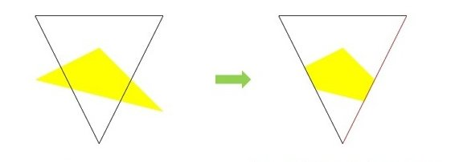
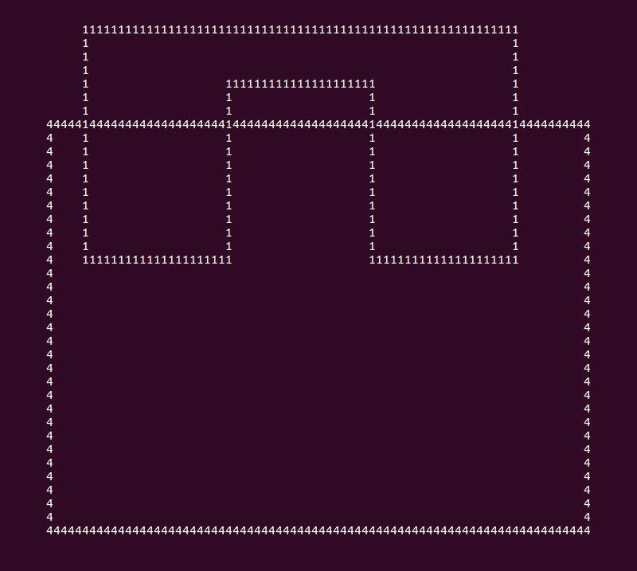
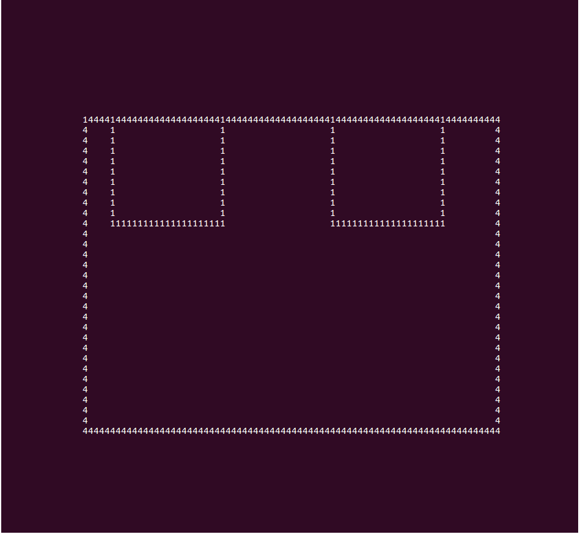
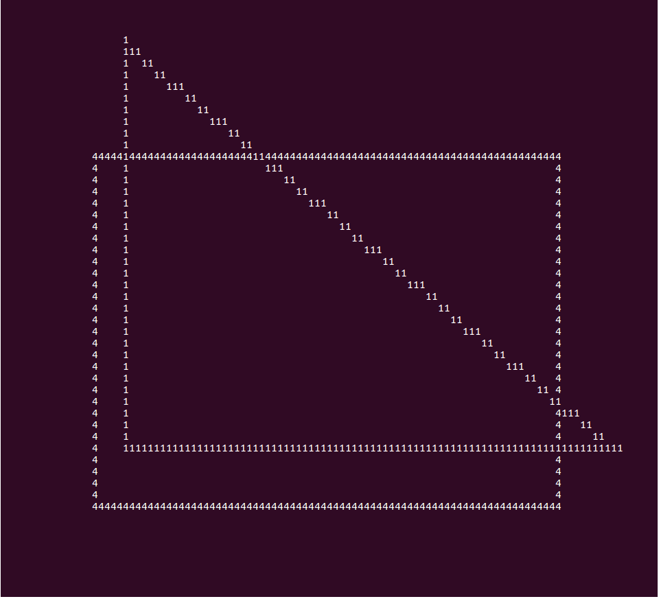
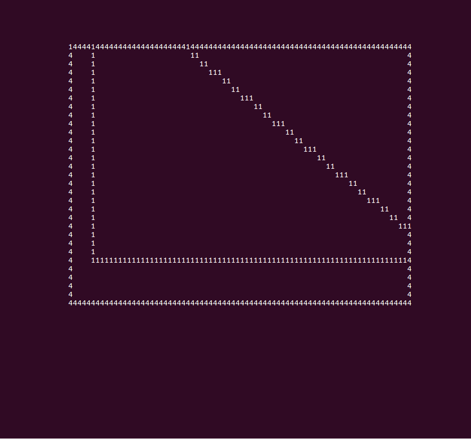
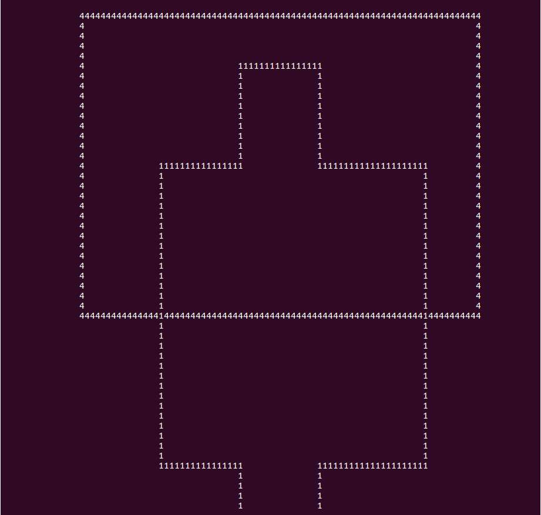
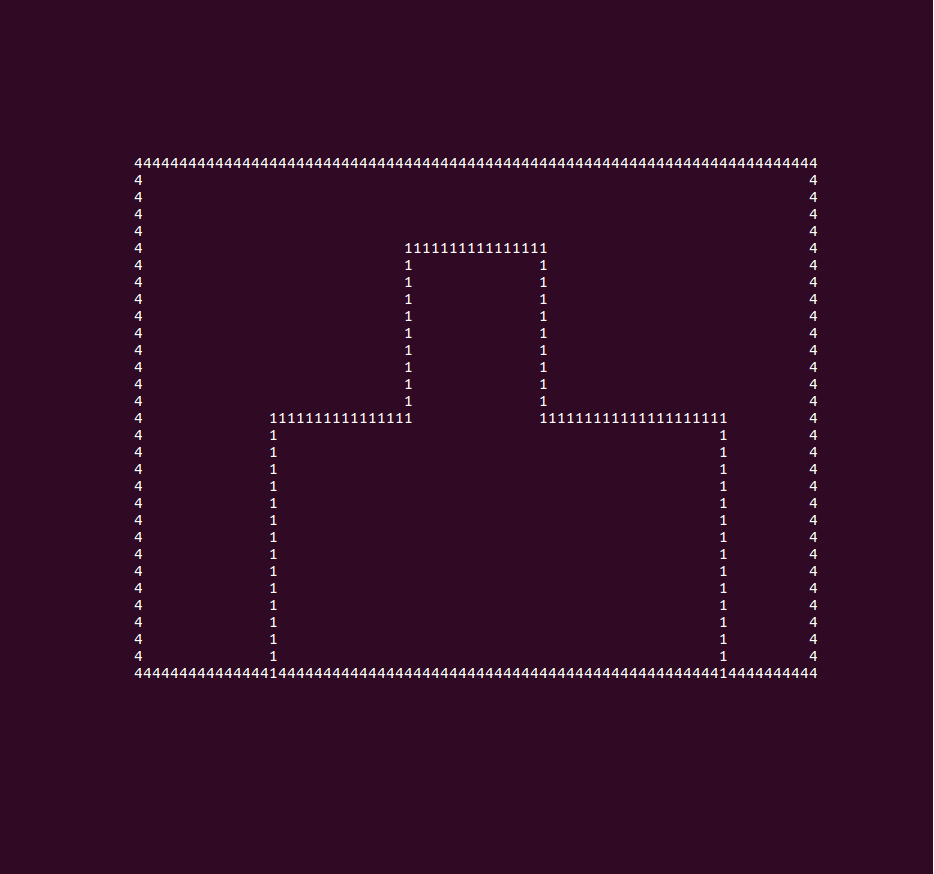
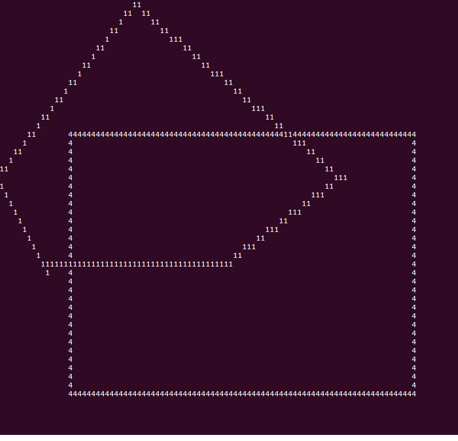
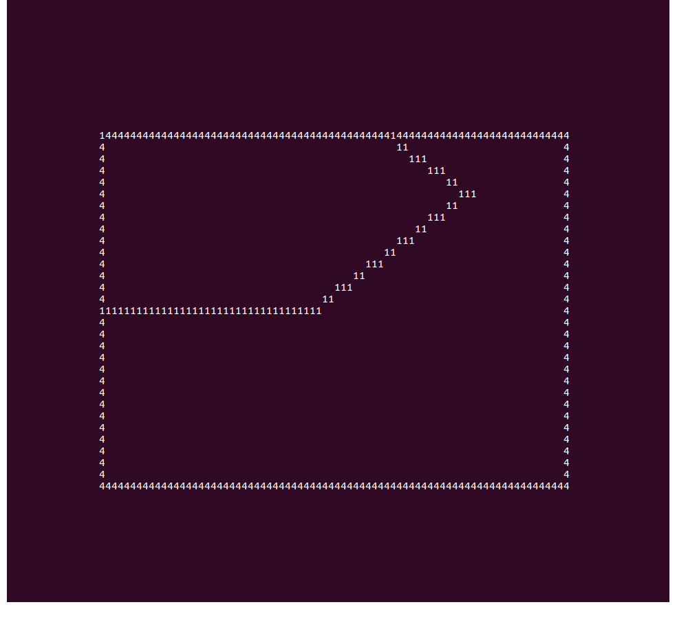

# ALGORITMO DE RECORTE DE POLÍGONOS ( SUTHERLAND-HODGMAN )

O algoritmo Sutherland-Hodgman é usado para recortar polígonos. Ele funciona estendendo
cada linha do polígono de clipe convexo e selecionando apenas vértices do polígono do assunto que estão no lado visível.

O algoritmo começa com uma lista de entrada de todos os vértices no polígono do assunto.
Em seguida, um lado do polígono de clipe é estendido infinitamente em ambas as direções e o caminho do polígono do assunto é percorrido. Os vértices da lista de entrada são inseridos em uma lista de saída se estiverem no lado visível da linha de polígono de clipe estendida e novos vértices são adicionados à lista de saída, onde o caminho do polígono do assunto cruza a linha do polígono de clipe estendido.


Esse processo é repetido iterativamente para cada lado do polígono do clipe, usando a lista de saída de um estágio como a lista de entrada para o próximo. Depois que todos os lados do polígono do clipe tiverem sido processados, a lista gerada final de vértices define um novo polígono único que é totalmente visível.

<br>




## FUNCIONAMENTO DO ALGORITMO

Esse programa funciona da seguinte forma, temos duas pastas uma com as dimensões da
janela e outra com os casos de teste que contém as coordenadas de cada ponto do polígono a ser recortado. Também utilizaremos o algoritmo DDA – Analisador Diferencial Digital para fazer a rasterização dos pontos informados tanto para a janela de recorte quanto para a formação do polígono.

Primeiramente imprimiremos a figura completa e em seguida aplicamos o algoritmo para encontrar os pontos de interseção com a janela de recorte e os pontos que pertencem a janela para termos uma lista de pontos com todos os vértices pertencentes a janela para ser rasterizada após o recorte. 

Como estou trabalhando com matriz multidimensional ao encontrar as interseções a imagem não é apagada pois fica salvo na matriz. Então preferi salvar os vértices do recorte e
rasterizá-los depois.


## PSEUDOCÓDIGO
```
Funcao sutherland recebe a lista de vértices do poligono:
    para cada limite do janela com poligono faça:
        lista de entrada recebe a lista de saida
        limpa a lista de saida
        ponto s = próxima valor da lista
        para cada E pertencente a lista de entrada faça:
            entro da janela:
                se não esta dentro da janela então:
                    adiciona a lista de saida o calculo da interseção do poligono
        com a janela.
                Fim se
                adiciona a lista de saida E
                senão se S esta dentro da janela então:
                    lista de saida recebe o cáculo da interseção do poligono com a janela
            fim se
            S recebe E
    fim para
fim funcao
```

## [_*CÓDIGO FONTE*_](https://github.com/felipekian/computacaoGrafica_recorte_sutherland-hodgman/tree/master/C%C3%B3digo%20Fonte)

## [_*TRABALHO ESCRITO*_](https://github.com/felipekian/computacaoGrafica_recorte_sutherland-hodgman/tree/master/Trabalho%20Escrito)

## IMAGENS DO PROGRAMA DE RECORTE DE POLÍGONOS


















## CONCLUSÃO

O algoritmo de Sutherland-Hodgman, é muito eficiente pois faz apenas quatro varredura a
procura de pontos de interseção para recortar o polígono. Sendo cada uma das iterações para cada lado da janela de recorte. Então a ideia é bem simples por trás do algoritmo de Sutherland-Hodgman.
